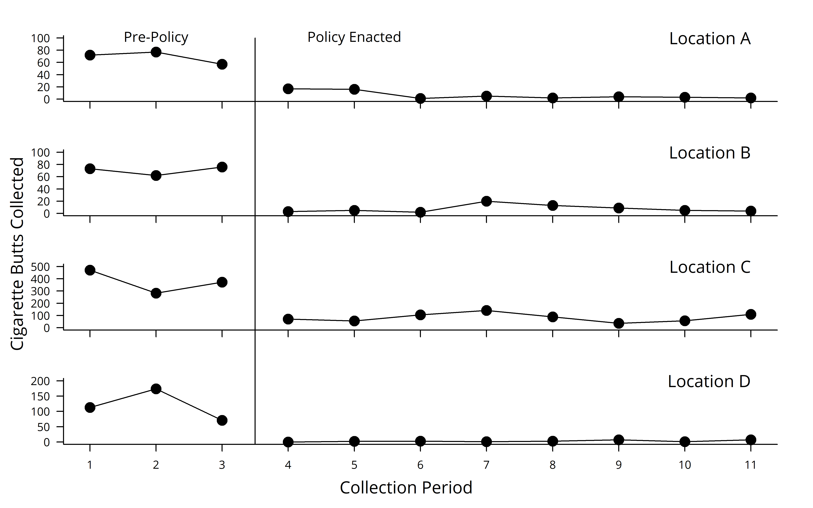

``` r
knitr::opts_chunk$set(echo = TRUE,
                      dev = 'png',
                      fig.path = 'plots/',
                      dpi = 600)

# Include for piping
suppressPackageStartupMessages(library(dplyr))

# Included for calculating FE CI's
suppressPackageStartupMessages(library(emmeans))

# Single-case plotting methods (MUST INSTALL FROM GITHUB, NOT CRAN)
suppressPackageStartupMessages(library(fxl))

# Methods for generating p-values
suppressPackageStartupMessages(library(lmtest))

# Methods for generating p-values
suppressPackageStartupMessages(library(lmerTest))

# Core fitting libraries
suppressPackageStartupMessages(library(nlme))

# Core fitting libraries
suppressPackageStartupMessages(library(tidyr))

# Read in data 
dataSetSmoking = read.csv("cigbuttdata.csv")
```

## Tobacco-Free Policy Reduces Combustible Tobacco Byproduct on a Large University Campus

Brett W. Gelino, Allyson R. Salzer, Joshua D. Harsin, Gideon P. Naudé

University of Kansas, Cofrin Logan Center for Addiction Research &
Treatment

Shawn P. Gilroy

Louisiana State University

Derek D. Reed

University of Kansas, Cofrin Logan Center for Addiction Research &
Treatment

## Abstract

Recent years reflect an increase in public-campus adoption of
tobacco-free regulation. Lower planning and implementation costs make
campus-level policy a convenient proxy for broader public policy. Given
the implications for community-level behavior change, demonstrating
policy-level effects via behavior analytic planning is of value. The
present study examines combustible tobacco-product refuse accumulation
on a large university campus preceding and following the enactment of a
tobacco-free policy. We compared waste across four sites flagged by
preliminary surveying among campus faculty, staff, and students. Widely
interpretable statistical testing suited for simple time-series research
designs supplements visual analysis. Results suggest (a) a meaningful
and sustained reduction of tobacco byproducts in all locations and (b) a
demonstrative extension of behavior analytic evaluation to a policy with
plausible community benefit.

## Cigarette Butt Dataset

The dataset included here includes several variables, a list of each
(and a snapshot of the dataset) are listed below:

*Location*: Grouping variable, individual facet in plotted outcomes

*Condition*: Dummy coded variable for intervention (0 = BL, 1 = TX)

*Count*: The number of cigarette butts collected (DV)

*Time*: Sequentially, the n months in which policy is/isn’t in place

*SC*: The slope change factors is dummy coded to reflect
**non-baseline** trend differences (i.e., in intervention; just for
Model IV)

### Data Types

``` r
str(dataSetSmoking)
```

    ## 'data.frame':    44 obs. of  5 variables:
    ##  $ Location : int  1 1 1 1 1 1 1 1 1 1 ...
    ##  $ Condition: int  0 0 0 1 1 1 1 1 1 1 ...
    ##  $ Count    : int  72 77 57 17 16 1 5 2 4 3 ...
    ##  $ Time     : int  1 2 3 4 5 6 7 8 9 10 ...
    ##  $ SC       : int  0 0 0 0 1 2 3 4 5 6 ...

### Data Preview

``` r
head(dataSetSmoking)
```

    ##   Location Condition Count Time SC
    ## 1        1         0    72    1  0
    ## 2        1         0    77    2  0
    ## 3        1         0    57    3  0
    ## 4        1         1    17    4  0
    ## 5        1         1    16    5  1
    ## 6        1         1     1    6  2

## Descriptive Illustration of Data

Quick eye-balling of the data.

<!-- -->

## Analytical Strategy

  - Step 1) Select a GLS model candidate per the Huitema & McKean time
    series approach (III/IV)

  - Step 2) Confirm that an OLS equivalent to optimal GLS model fails
    assumptions

  - Step 3) Evaluate whether random effects are warranted for optimal
    GLS Model

### Step 1) Model Candidates

Huitema & McKean (HM) presented 4 different modeling strategies to
characterize times-series data. Generally, there are two models (i.e.,
phase level alone, phase level and trend) evaluated with and without
addressing autocorrelated errors. Broadly, HM noted that you can
evaluate all 4 or just focus on the two that model autocorrelated errors
(i.e., Model III \[Trend Change\], Model IV \[Trend + Slope Change\]).

#### Model IV

``` r
modelIV = gls(Count ~ Time + Condition + SC,
              correlation = corAR1(form = ~ Time | Location),
              control = glsControl(
                maxIter = 1000,
                msMaxIter = 1000,
                opt = "optim"
              ),
              method = "ML",
              data = dataSetSmoking)

summary(modelIV)
```

    ## Generalized least squares fit by maximum likelihood
    ##   Model: Count ~ Time + Condition + SC 
    ##   Data: dataSetSmoking 
    ##       AIC      BIC   logLik
    ##   488.872 499.5771 -238.436
    ## 
    ## Correlation Structure: AR(1)
    ##  Formula: ~Time | Location 
    ##  Parameter estimate(s):
    ##       Phi 
    ## 0.8265007 
    ## 
    ## Coefficients:
    ##                  Value Std.Error   t-value p-value
    ## (Intercept)  200.15185  58.49461  3.421714  0.0014
    ## Time         -19.15395  19.18315 -0.998478  0.3240
    ## Condition   -101.93882  36.13681 -2.820913  0.0074
    ## SC            20.23398  22.40499  0.903101  0.3719
    ## 
    ##  Correlation: 
    ##           (Intr) Time   Condtn
    ## Time      -0.662              
    ## Condition  0.249 -0.626       
    ## SC         0.486 -0.931  0.523
    ## 
    ## Standardized residuals:
    ##        Min         Q1        Med         Q3        Max 
    ## -1.1840173 -0.2726276 -0.2250470  0.1063566  3.1502211 
    ## 
    ## Residual standard error: 92.0577 
    ## Degrees of freedom: 44 total; 40 residual

#### Model III

``` r
modelIII = gls(Count ~ Condition,
              correlation = corAR1(form = ~ Time | Location),
              control = glsControl(
                maxIter = 1000,
                msMaxIter = 1000,
                opt = "optim"
              ),
              method = "ML",
              data = dataSetSmoking)

summary(modelIII)
```

    ## Generalized least squares fit by maximum likelihood
    ##   Model: Count ~ Condition 
    ##   Data: dataSetSmoking 
    ##        AIC      BIC    logLik
    ##   485.9604 493.0971 -238.9802
    ## 
    ## Correlation Structure: AR(1)
    ##  Formula: ~Time | Location 
    ##  Parameter estimate(s):
    ##       Phi 
    ## 0.8247745 
    ## 
    ## Coefficients:
    ##                 Value Std.Error   t-value p-value
    ## (Intercept)  159.9737  37.93196  4.217387   1e-04
    ## Condition   -124.9795  27.24520 -4.587211   0e+00
    ## 
    ##  Correlation: 
    ##           (Intr)
    ## Condition -0.447
    ## 
    ## Standardized residuals:
    ##         Min          Q1         Med          Q3         Max 
    ## -1.10933461 -0.36621976 -0.32851431  0.04590222  3.35068136 
    ## 
    ## Residual standard error: 92.82478 
    ## Degrees of freedom: 44 total; 42 residual

#### Model Comparisons

The HM models can be compared directly using common methods,
i.e. Likelihood Ratio Test (LRT). Briefly, assuming fits by Maximum
Likelihood, the two can be compared in terms of likelihood (H0 = simpler
is better).

Using the LRT included in *nlme* (override of *anova* function), the
fits are as follows:

``` r
anova(modelIV, modelIII)
```

    ##          Model df      AIC      BIC    logLik   Test  L.Ratio p-value
    ## modelIV      1  6 488.8720 499.5771 -238.4360                        
    ## modelIII     2  4 485.9604 493.0971 -238.9802 1 vs 2 1.088423  0.5803

Conclusion: *there is insufficient evidence to reject the null
hypothesis that the simpler model \[Phase Differences alone\] is
better.*

### Step 2) Justify Generalized Least Squares

Model I is the OLS complement to Model III (GLS). Model I is fitted here
to examine whether the residuals appear randomly distributed.

``` r
modelII = lm(Count ~ Condition,
            data = dataSetSmoking)

dwtest(modelII, alternative = "two.sided")
```

    ## 
    ##  Durbin-Watson test
    ## 
    ## data:  modelII
    ## DW = 0.94951, p-value = 0.000111
    ## alternative hypothesis: true autocorrelation is not 0

Conclusion: *Significant autocorrelation present and residuals do not
appear randomly distributed around 0.* Model III is the way to go.

### Step 3) Evaluate Utility of Random Effects

``` r
modelIIIre = lme(Count ~ Condition,
                 random = ~ 1 | Location,
                 correlation = corAR1(form = ~ Time | Location),
                 method = "ML",
                 data = dataSetSmoking)

anova(modelIII, modelIIIre)
```

    ##            Model df      AIC      BIC    logLik   Test  L.Ratio p-value
    ## modelIII       1  4 485.9604 493.0971 -238.9802                        
    ## modelIIIre     2  5 486.0185 494.9394 -238.0092 1 vs 2 1.941912  0.1635

Conclusion: *there is insufficient evidence to reject the null
hypothesis that the simpler model \[Phase Differences alone without
random effects\] is better*.

## Results

``` r
summary(modelIII)
```

    ## Generalized least squares fit by maximum likelihood
    ##   Model: Count ~ Condition 
    ##   Data: dataSetSmoking 
    ##        AIC      BIC    logLik
    ##   485.9604 493.0971 -238.9802
    ## 
    ## Correlation Structure: AR(1)
    ##  Formula: ~Time | Location 
    ##  Parameter estimate(s):
    ##       Phi 
    ## 0.8247745 
    ## 
    ## Coefficients:
    ##                 Value Std.Error   t-value p-value
    ## (Intercept)  159.9737  37.93196  4.217387   1e-04
    ## Condition   -124.9795  27.24520 -4.587211   0e+00
    ## 
    ##  Correlation: 
    ##           (Intr)
    ## Condition -0.447
    ## 
    ## Standardized residuals:
    ##         Min          Q1         Med          Q3         Max 
    ## -1.10933461 -0.36621976 -0.32851431  0.04590222  3.35068136 
    ## 
    ## Residual standard error: 92.82478 
    ## Degrees of freedom: 44 total; 42 residual

<!-- -->

Takeaways: The overall baseline (Intercept) level was \~159 cigarette
butts counted on site overall prior to the policy change. Following the
introduction of the policy, overall, there was a -124 change in the
level of cigarette butts counted across sites (77.99 percent decrease).
